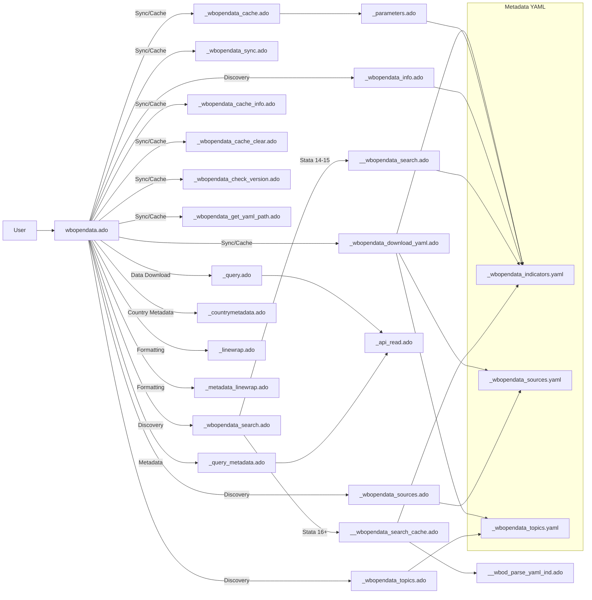

# wbopendata Architecture

This diagram summarizes the main execution flow, helper modules, and metadata pathways for the `wbopendata` Stata package.

## High-level flow

## Notes

- The main entry point is `wbopendata.ado`.
- Discovery commands (sources, topics, search, info) rely on cached YAML metadata.
- Metadata synchronization runs through `_wbopendata_sync.ado`, which selects the sync pathway.
- Cache management lives in `_wbopendata_cache*.ado` helpers.
- Stata 16+ uses a frame-based cached search path for performance; earlier versions parse on each call.
- Data download flows through `_query.ado` and `_api_read.ado`, with metadata fetched by `_query_metadata.ado`.

Sync pathway order:
1. Python canonical pipeline (when available).
2. Stata fallback refresh.
3. GitHub release download (last resort).

Cache metadata:
- Files: metadata_version.txt, cache_timestamp.txt, cache_metadata.yaml, cache_sync_history.yaml.
- cache_metadata.yaml records platform, version, synced_at, method, and source.

## Metadata automation (Python)

The repository includes an optional Python-based metadata pipeline (Pathway C) that rebuilds the YAML metadata stored under src/_/. It complements the Stata-side metadata sync by providing a reproducible, schema-validated pipeline for refreshing indicators, sources, and topics.

- Orchestrator: [src/py/update_metadata.py](../../src/py/update_metadata.py) loads configuration, calls the API client, generates YAML, validates against schema, and can stage/commit/tag outputs.
- API client: [src/py/wb_api_client.py](../../src/py/wb_api_client.py) handles World Bank API pagination, retries, and optional raw JSON snapshots.
- YAML generation: [src/py/yaml_generator.py](../../src/py/yaml_generator.py) transforms API payloads into the YAML schema (v2.0.0) for indicators/sources/topics.
- Validation: [src/py/schema_validator.py](../../src/py/schema_validator.py) enforces schema correctness using config/schema_yaml_v2.json.
- Diff summary: [src/py/diff_analyzer.py](../../src/py/diff_analyzer.py) computes added/removed keys vs the previous YAMLs.
- Git helper: [src/py/git_manager.py](../../src/py/git_manager.py) stages/commits/tag outputs when enabled.

Configuration and outputs:

- Config: config/config_update.yaml controls API settings, output locations, validation, and git automation.
- Schema: config/schema_yaml_v2.json defines YAML structure and validation rules.
- YAML standard: YAML 1.2 JSON Schema subset (interoperable subset used by yaml.ado).
- Outputs: src/_/_wbopendata_indicators.yaml, src/_/_wbopendata_sources.yaml, src/_/_wbopendata_topics.yaml.
- Logs: logs/update_metadata_YYYYMMDD_HHMMSS.log for pipeline runs.

Usage (Python metadata pipeline):

- From repo root: run src/py/update_metadata.py with optional flags.
- Defaults load config/config_update.yaml and write YAMLs to src/_/.
- Typical runs:
    - Basic run: python src/py/update_metadata.py
    - Override output dir: python src/py/update_metadata.py --output-dir src/_
    - Save raw API responses: python src/py/update_metadata.py --save-raw
    - Skip schema validation: python src/py/update_metadata.py --no-validate
    - Skip diff summary: python src/py/update_metadata.py --skip-diff
    - Stage/commit outputs: python src/py/update_metadata.py --commit
    - Stage/commit + tag: python src/py/update_metadata.py --commit --tag
