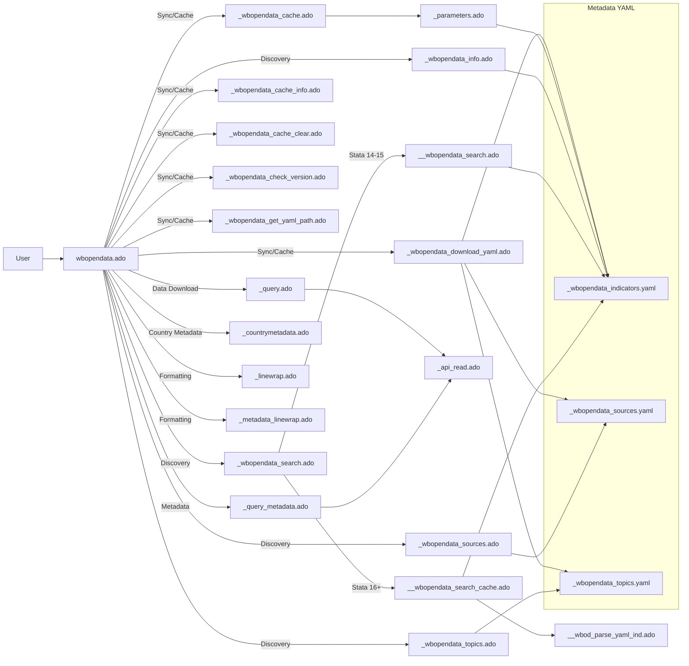

# wbopendata Architecture

This diagram summarizes the main execution flow, helper modules, and metadata pathways for the `wbopendata` Stata package.

## High-level flow

## Notes

- The main entry point is `wbopendata.ado`.
- Discovery commands (sources, topics, search, info) rely on cached YAML metadata.
- Metadata synchronization and cache management live in `_wbopendata_cache*.ado` helpers.
- Stata 16+ uses a frame-based cached search path for performance; earlier versions parse on each call.
- Data download flows through `_query.ado` and `_api_read.ado`, with metadata fetched by `_query_metadata.ado`.
