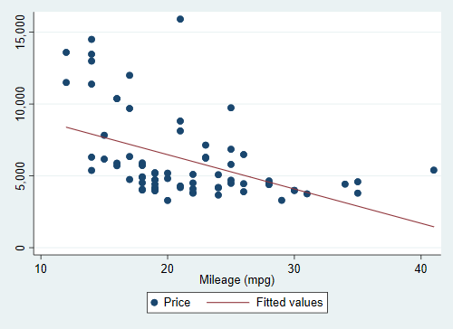

        # Exercise 1

        Open the 1978 Automobile Data and summarize price and milage.

<pre id="stlog-1" class="stlog"><samp>. sysuse auto
(1978 Automobile Data)

. summarize price mpg

    Variable |        Obs        Mean    Std. Dev.       Min        Max
-------------+---------------------------------------------------------
       price |         74    6165.257    2949.496       3291      15906
         mpg |         74     21.2973    5.785503         12         41
</samp></pre>

        # Exercise 2

        Run a regression of price on milage and display the relation in a scatter plot.

<pre id="stlog-2" class="stlog"><samp>. regress price mpg

      Source |       SS           df       MS      Number of obs   =        74
-------------+----------------------------------   F(1, 72)        =     20.26
       Model |   139449474         1   139449474   Prob &gt; F        =    0.0000
    Residual |   495615923        72  6883554.48   R-squared       =    0.2196
-------------+----------------------------------   Adj R-squared   =    0.2087
       Total |   635065396        73  8699525.97   Root MSE        =    2623.7

------------------------------------------------------------------------------
       price |      Coef.   Std. Err.      t    P&gt;|t|     [95% Conf. Interval]
-------------+----------------------------------------------------------------
         mpg |  -238.8943   53.07669    -4.50   0.000    -344.7008   -133.0879
       _cons |   11253.06   1170.813     9.61   0.000     8919.088    13587.03
------------------------------------------------------------------------------

. twoway (scatter price mpg) (lfit price mpg)
</samp></pre>
<figure id="fig-2">

</figure>
<pre id="stlog-3" class="stlog"><samp>. *   --- end of file ---
</samp></pre>
