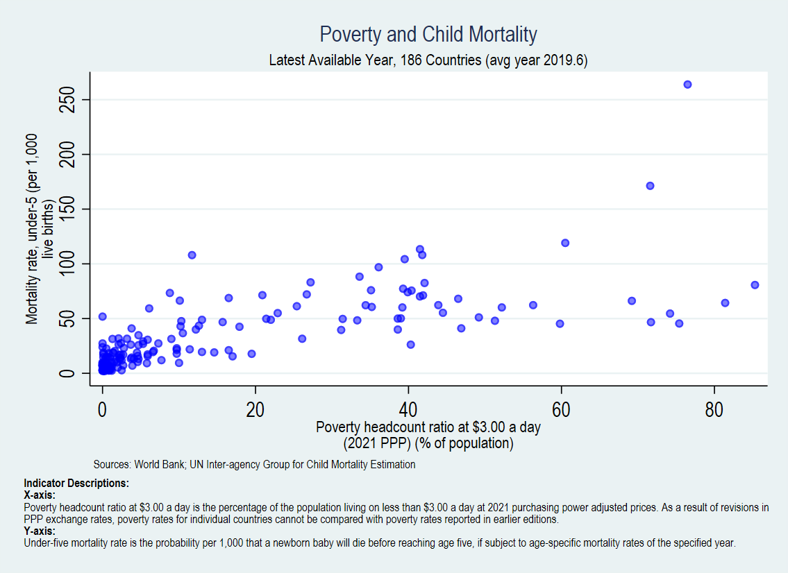
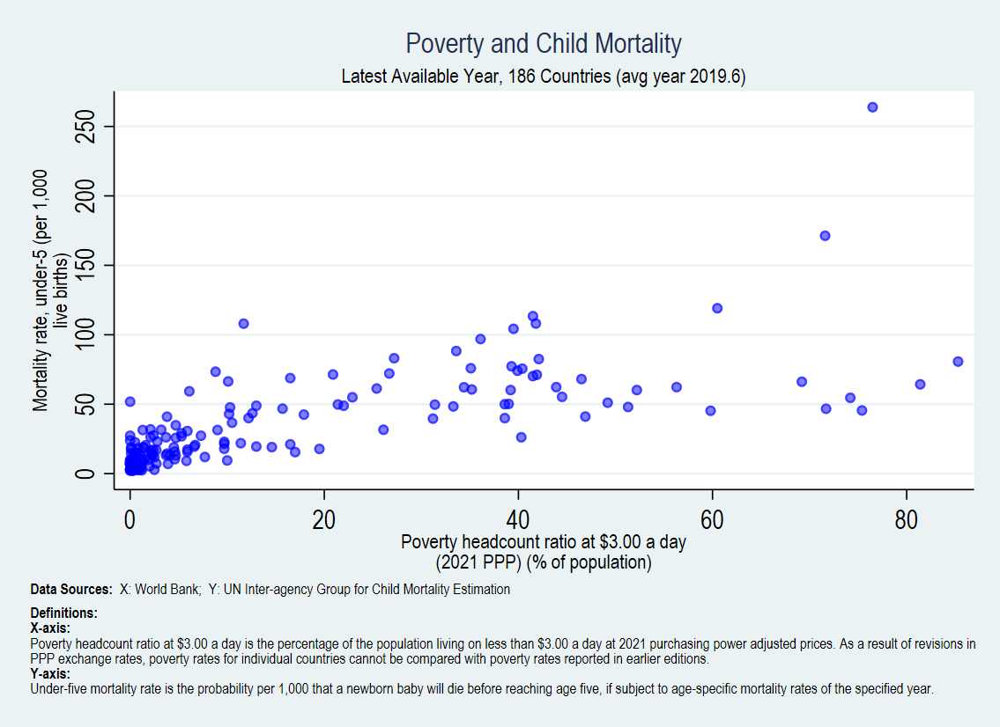

# wbopendata Examples Gallery

[← Back to README](../../README.md) | [FAQ](FAQ.md) | [Do Files](examples/) | [Changelog](../../CHANGELOG.md)

---

This gallery showcases `wbopendata` capabilities with the exact code used to generate the output figures.

**Version**: 17.7.1 | **Last Updated**: January 2026

> **Note**: Some examples require user-written commands (`spmap`, `alorenz`). Install them with:
> ```stata
> ssc install spmap
> ssc install alorenz
> ```

---

## Table of Contents

### New in v17.7: Basic Metadata by Default
- All downloads now include country context variables (region, income level, etc.)
- Use `nobasic` to suppress default variables

### New in v17.6: Graph Metadata Features
1. [Graph Metadata with linewrap()](#graph-metadata-with-linewrap)
2. [Dynamic Subtitle with r(latest)](#dynamic-subtitle-with-rlatest)
3. [Layout Option A: Caption + Note](#layout-option-a-caption--note)
4. [Layout Option D: Separate Sources](#layout-option-d-separate-sources)
5. [Layout Option F: Compact Sources](#layout-option-f-compact-sources)
6. [Layout Option G: All-in-Caption](#layout-option-g-all-in-caption)

### Classic Examples
7. [World Map - Mobile Phone Coverage](#example-7-world-map---mobile-phone-coverage)
8. [Poverty vs. Income (Single Country Highlight)](#example-8-poverty-vs-income-single-country-highlight)
9. [Regional Poverty Reduction Episodes](#example-9-regional-poverty-reduction-episodes)
10. [MDG Progress Tracking](#example-10-mdg-progress-tracking)
11. [Poverty vs. Income (Regional Aggregates)](#example-11-poverty-vs-income-regional-aggregates)

---

# New in v17.4: Graph Metadata Features

These examples demonstrate the new `linewrap()`, `maxlength()`, `r(latest)`, and `r(sourcecite#)` features for creating publication-ready graphs with automatic metadata formatting.

---

## Graph Metadata with linewrap()

The `linewrap()` option wraps long metadata text for graph titles, captions, and notes. Use `maxlength()` to control characters per line.

### Key Returns

| Return | Description |
|--------|-------------|
| `r(name#_stack)` | Wrapped indicator name for `title()` |
| `r(description#_stack)` | Wrapped description for `caption()` |
| `r(sourcecite#)` | Clean organization name (e.g., "World Bank (WB)") |
| `r(latest)` | Dynamic subtitle: "Latest Available Year, N Countries (avg year XXXX.X)" |
| `r(latest_ncountries)` | Number of countries |
| `r(latest_avgyear)` | Average year of data |

### Basic Usage

```stata
* Download with linewrap - different maxlength for each field
wbopendata, indicator(SI.POV.DDAY; SH.DYN.MORT) clear long latest ///
    linewrap(name description note) maxlength(40 180 180)

* Access wrapped returns
local name1 `"`r(name1_stack)'"'      // Wrapped name for titles
local desc1 `"`r(description1_stack)'"' // Wrapped description
local src1 "`r(sourcecite1)'"          // Clean source: "World Bank (WB)"
```

---

## Dynamic Subtitle with r(latest)

When using the `latest` option, wbopendata returns `r(latest)` with a formatted subtitle showing the number of countries and average year.

### Code

```stata
wbopendata, indicator(SI.POV.DDAY; SH.DYN.MORT) clear long latest ///
    linewrap(name description) maxlength(40 180)

* Get dynamic subtitle
local subtitle "`r(latest)'"
di "`subtitle'"
// Output: "Latest Available Year, 186 Countries (avg year 2019.6)"

* Use in graph
twoway scatter sh_dyn_mort si_pov_dday, ///
    title("Poverty and Child Mortality") ///
    subtitle("`subtitle'")
```

### Available Returns

```stata
return list
// r(latest)            : "Latest Available Year, 186 Countries (avg year 2019.6)"
// r(latest_ncountries) : "186"
// r(latest_avgyear)    : "2019.6"
```

---

## Layout Option A: Caption + Note

**Best for**: Separating indicator definitions from data sources

- **Caption**: Indicator descriptions (definitions)
- **Note**: Data sources on one line

### Code

```stata
wbopendata, indicator(SI.POV.DDAY; SH.DYN.MORT) clear long latest ///
    linewrap(name description note) maxlength(40 180 180)

* Store returns
local name1 `"`r(name1_stack)'"'
local name2 `"`r(name2_stack)'"'
local desc1 `"`r(description1_stack)'"'
local desc2 `"`r(description2_stack)'"'
local src1 "`r(sourcecite1)'"
local src2 "`r(sourcecite2)'"
local subtitle "`r(latest)'"

twoway (scatter sh_dyn_mort si_pov_dday, msize(small) mcolor(blue%50)), ///
    xtitle(`name1', size(small)) ///
    ytitle(`name2', size(small)) ///
    title("Poverty and Child Mortality", size(medium)) ///
    subtitle("`subtitle'", size(small)) ///
    caption("{bf:Indicator Descriptions:}" ///
            "{bf:X-axis:} " `desc1' ///
            "{bf:Y-axis:} " `desc2', size(vsmall) span) ///
    note("Sources: `src1'; `src2'", size(vsmall))
```

### Output



*Option A: Definitions in caption, sources in note (one line)*

---

## Layout Option D: Separate Sources

**Best for**: Clear attribution when sources differ between X and Y variables

- **Caption**: Indicator descriptions
- **Note**: Sources labeled separately for X and Y

### Code

```stata
twoway (scatter sh_dyn_mort si_pov_dday, msize(small) mcolor(blue%50)), ///
    xtitle(`name1', size(small)) ///
    ytitle(`name2', size(small)) ///
    title("Poverty and Child Mortality", size(medium)) ///
    subtitle("`subtitle'", size(small)) ///
    caption("{bf:Definitions:}" ///
            "{bf:X-axis:} " `desc1' ///
            "{bf:Y-axis:} " `desc2', size(vsmall) span) ///
    note("{bf:Data Sources:}" ///
         "{bf:X (Poverty):} `src1'" ///
         "{bf:Y (Mortality):} `src2'", size(vsmall))
```

### Output


*Option D: Sources clearly labeled for each axis*

---

## Layout Option F: Compact Sources

**Best for**: Space-constrained figures where sources fit on one line

- **Caption**: Indicator descriptions (spans full width)
- **Note**: Both sources on a single line

### Code

```stata
twoway (scatter sh_dyn_mort si_pov_dday, msize(small) mcolor(blue%50)), ///
    xtitle(`name1', size(small)) ///
    ytitle(`name2', size(small)) ///
    title("Poverty and Child Mortality", size(medium)) ///
    subtitle("`subtitle'", size(small)) ///
    caption("{bf:Definitions:}" ///
            "{bf:X-axis:} " `desc1' ///
            "{bf:Y-axis:} " `desc2', size(vsmall) span) ///
    note("{bf:Data Sources:}  X: `src1';  Y: `src2'", size(vsmall) span)
```

### Output



*Option F: Sources on one line with span for full width*

---

## Layout Option G: All-in-Caption

**Best for**: Self-contained figures with all metadata in one location

- **Caption**: Everything - descriptions AND sources
- **Note**: Empty (or for other annotations)

### Code

```stata
twoway (scatter sh_dyn_mort si_pov_dday, msize(small) mcolor(blue%50)), ///
    xtitle(`name1', size(small)) ///
    ytitle(`name2', size(small)) ///
    title("Poverty and Child Mortality", size(medium)) ///
    subtitle("`subtitle'", size(small)) ///
    caption("{bf:Definitions:}" ///
            "{bf:X-axis:} " `desc1' ///
            "{bf:Y-axis:} " `desc2' "" ///
            "{bf:Data Sources:}" ///
            "{bf:X (Poverty):} `src1'" ///
            "{bf:Y (Mortality):} `src2'", size(vsmall) span)
```

### Output


*Option G: Definitions and sources all in caption*

---

## Layout Comparison Summary

| Layout | Caption | Note | Best For |
|--------|---------|------|----------|
| **A** | Definitions | Sources (1 line) | Standard publications |
| **D** | Definitions | Sources (labeled X/Y) | Different data sources |
| **F** | Definitions | Sources (compact) | Space-constrained |
| **G** | Everything | Empty | Self-contained figures |

---

# Classic Examples

## Example 7: World Map - Mobile Phone Coverage

Create a choropleth map of mobile cellular subscriptions per 100 people.

### Code

```stata
* Download latest mobile subscription data
qui tempfile tmp
wbopendata, language(en - English) indicator(it.cel.sets.p2) long clear latest

* Store label and save data
local labelvar "`r(varlabel1)'"
sort countrycode
save `tmp', replace

* Merge with world shapefile
qui sysuse world-d, clear
qui merge countrycode using `tmp'

* Get average year for note
qui sum year
local avg = string(`r(mean)',"%16.1f")

* Create choropleth map
spmap it_cel_sets_p2 using "world-c.dta", id(_ID) ///
    clnumber(20) fcolor(Reds2) ocolor(none ..) ///
    title("`labelvar'", size(*1.2)) ///
    legstyle(3) legend(ring(1) position(3)) ///
    note("Source: World Development Indicators (latest available year: `avg') using Azevedo, J.P. (2011) wbopendata: Stata module to " ///
         "access World Bank databases, Statistical Software Components S457234 Boston College Department of Economics.")
```

### Output


*Figure 7: Mobile cellular subscriptions per 100 people (latest available year)*

---

## Example 8: Poverty vs. Income (Single Country Highlight)

Benchmark poverty levels against GDP per capita, highlighting a specific country.

### Code

```stata
* Download poverty and GDP per capita data
wbopendata, indicator(si.pov.dday; ny.gdp.pcap.pp.kd) clear long latest

* Prepare axis labels using linewrap (user-written command)
linewrap, longstring("`r(varlabel1)'") maxlength(52) name(ylabel)
linewrap, longstring("`r(varlabel2)'") maxlength(52) name(xlabel)

* Create scatter plot with single country highlight and lowess fit
twoway ///
    (scatter si_pov_dday ny_gdp_pcap_pp_kd, msize(*.2)) ///
    (scatter si_pov_dday ny_gdp_pcap_pp_kd if string(si_pov_dday) == "35.8", ///
        msize(*.8) mlabel(countryname)) ///
    (lowess si_pov_dday ny_gdp_pcap_pp_kd) ///
    if region != "NA", ///
    legend(off) ///
    xtitle("`r(xlabel1)'" "`r(xlabel2)'" "`r(xlabel3)'") ///
    ytitle("`r(ylabel1)'" "`r(ylabel2)'" "`r(ylabel3)'") ///
    note("Source: `r(source1)' using WBOPENDATA")
```

### Output


*Figure 8: Poverty headcount ratio vs. GDP per capita with single country highlighted*

---

## Example 9: Regional Poverty Reduction Episodes

Analyze episodes of poverty reduction by region using Lorenz curves.

### Code

```stata
* Download poverty data
wbopendata, indicator(si.pov.dday) clear long

* Clean and prepare data
drop if si_pov_dday == .
sort countryname year

* Calculate annualized change in poverty
bysort countryname: gen diff_pov = (si_pov_dday - si_pov_dday[_n-1]) / (year - year[_n-1])

* Create encoded variables for labeling
encode region, gen(reg)
encode countryname, gen(reg2)

* Keep only regional aggregates
keep if regionname == "Aggregates"

* Create Lorenz curve of poverty reduction episodes
alorenz diff_pov, gp points(20) xdecrease markvar(reg2) ///
    ytitle("Change in Poverty (p.p.)") ///
    xtitle("Proportion of regional episodes of poverty reduction (%)") ///
    legend(off) ///
    title("Poverty Reduction") ///
    note("Source: World Development Indicators using Azevedo, J.P. (2011) wbopendata: Stata module to " ///
         "access World Bank databases, Statistical Software Components S457234 Boston College Department of Economics.", size(*.7))
```

### Output


*Figure 9: Distribution of poverty reduction episodes across regional aggregates*

---

## Example 10: MDG Progress Tracking

Benchmark Millennium Development Goal progress using 2008 as cutoff value.

### Code

```stata
* Download poverty data
wbopendata, indicator(si.pov.dday) clear long

* Clean data
drop if si_pov_dday == .
sort countryname year

* Keep only regional aggregates
keep if regionname == "Aggregates"

* Calculate change in poverty
bysort countryname: gen diff_pov = (si_pov_dday - si_pov_dday[_n-1]) / (year - year[_n-1])

* Set 1990 baseline
gen baseline = si_pov_dday if year == 1990
sort countryname baseline
bysort countryname: replace baseline = baseline[1] if baseline == .

* Calculate MDG target (halve 1990 poverty by 2015)
gen mdg1 = baseline / 2

* Get 2008 values
gen present = si_pov_dday if year == 2008
sort countryname present
bysort countryname: replace present = present[1] if present == .

* Calculate 2008 target based on linear path
gen target = ((baseline - mdg1) / (2008 - 1990)) * (2015 - 1990)

* Create 45-degree reference line
sort countryname year
gen angel45x = .
gen angle45y = .
replace angel45x = 0 in 1
replace angle45y = 0 in 1
replace angel45x = 80 in 2
replace angle45y = 80 in 2

* Create scatter plot with 45-degree line
graph twoway ///
    (scatter present target if year == 2008, mlabel(countrycode)) ///
    (line angle45y angel45x), ///
    legend(off) ///
    xtitle("Target for 2008") ///
    ytitle("Present") ///
    title("MDG 1 - 1.9 USD") ///
    note("Source: World Development Indicators (latest available year: 2008) using Azevedo, J.P. (2011) wbopendata: Stata module to " ///
         "access World Bank databases, Statistical Software Components S457234 Boston College Department of Economics.", size(*.7))
```

### Output


*Figure 10: MDG1 poverty reduction progress - countries above the 45° line are behind target*

---

## Example 11: Poverty vs. Income (Regional Aggregates)

Benchmark poverty levels against GDP per capita, highlighting regional averages.

### Code

```stata
* Download poverty and GDP data
wbopendata, indicator(si.pov.dday; ny.gdp.pcap.pp.kd) clear long latest

* Store timestamp
local time "$S_FNDATE"

* Prepare axis labels
linewrap, longstring("`r(varlabel1)'") maxlength(52) name(ylabel)
linewrap, longstring("`r(varlabel2)'") maxlength(52) name(xlabel)

* Create scatter plot with regional aggregates labeled
graph twoway ///
    (scatter si_pov_dday ny_gdp_pcap_pp_kd, msize(*.3)) ///
    (scatter si_pov_dday ny_gdp_pcap_pp_kd if regionname == "Aggregates", ///
        msize(*.8) mlabel(countryname) mlabsize(*.8) mlabangle(25)) ///
    (lowess si_pov_dday ny_gdp_pcap_pp_kd), ///
    legend(off) ///
    xtitle("`r(xlabel1)'" "`r(xlabel2)'" "`r(xlabel3)'") ///
    ytitle("`r(ylabel1)'" "`r(ylabel2)'" "`r(ylabel3)'") ///
    note("Source: World Development Indicators (latest available year as off `time') using Azevedo, J.P. (2011) wbopendata: Stata" ///
         "module to access World Bank databases, Statistical Software Components S457234 Boston College Department of Economics.", size(*.7))
```

### Output


*Figure 11: Poverty headcount ratio vs. GDP per capita with regional aggregates labeled*

---

## Additional Examples

For more examples including:
- Downloading by topic
- Downloading for specific countries
- Using the `match()` option for country metadata
- Year range selection
- Wide vs. long format

See the complete [wbopendata.md](wbopendata.md) documentation or the runnable [do files](examples/).

---

## Running These Examples

### Prerequisites

```stata
* Ensure wbopendata is updated to v17.4+
which wbopendata

* Install optional user-written commands for advanced examples
ssc install spmap      // for choropleth maps
ssc install alorenz    // for Lorenz curves
```

### Quick Start with New Features

```stata
* Basic linewrap usage
wbopendata, indicator(SI.POV.DDAY) clear long latest linewrap(name) maxlength(45)
di `"`r(name1_stack)'"'

* Multiple maxlengths for different fields
wbopendata, indicator(SI.POV.DDAY; SH.DYN.MORT) clear long latest ///
    linewrap(name description note) maxlength(40 180 180)

* Access all returns
return list
```

### From Command Line

```stata
* Run all examples
do "doc/examples/basic_usage.do"
do "doc/examples/advanced_usage.do"

* Run graph metadata examples specifically
do "doc/examples/output/test_options_AD_140.do"
```

---

## See Also

- [FAQ](FAQ.md) - Troubleshooting common issues
- [Do File Examples](examples/) - Runnable Stata code
- [Full Documentation](wbopendata.md) - Complete code output log
- [README](../README.md) - Main documentation
- [CHANGELOG](../CHANGELOG.md) - Version history

---

*Need more examples? [Open an issue](https://github.com/jpazvd/wbopendata/issues) with your use case!*
