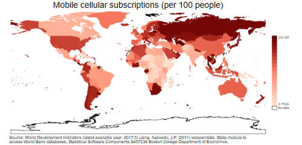
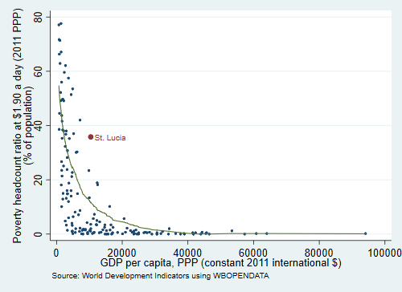
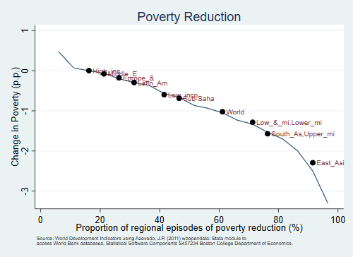
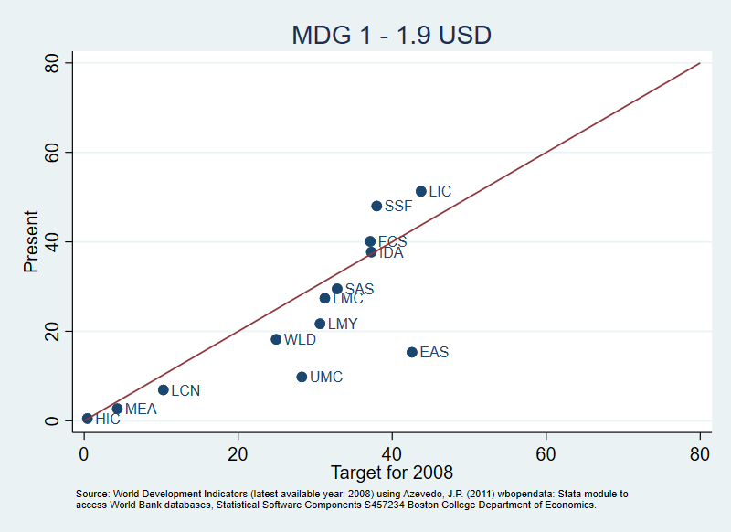
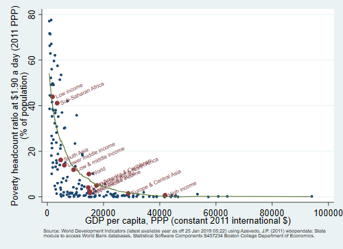

# Examples 

## Version control [(back)](master/README.md#examples)
	
<pre id="stlog-1" class="stlog"><samp>. which wbopendata
.\w\wbopendata.ado
*!  v 16.0          28Oct2019               by Joao Pedro Azevedo 

. which _query
.\_\_query.ado
*! v 16.0   29Oct2019                           by Joao Pedro Azevedo

. which wbopendata.sthlp
.\w\wbopendata.sthlp
</samp></pre>
## Example 1 [(back)](master/README.md#examples)

### Download all WDI indiators for a single country (i.e. China)

<pre id="stlog-2" class="stlog"><samp>. wbopendata, country(chn - China) clear

. tab indicatorcode in 1/10

           Indicator Code |      Freq.     Percent        Cum.
--------------------------+-----------------------------------
              SI.POV.URGP |          1       10.00       10.00
              SI.POV.URHC |          1       10.00       20.00
        SI.RMT.COST.IB.ZS |          1       10.00       30.00
        SI.RMT.COST.OB.ZS |          1       10.00       40.00
              SI.SPR.PC40 |          1       10.00       50.00
           SI.SPR.PC40.ZG |          1       10.00       60.00
              SI.SPR.PCAP |          1       10.00       70.00
           SI.SPR.PCAP.ZG |          1       10.00       80.00
        SL.AGR.0714.FE.ZS |          1       10.00       90.00
        SL.AGR.0714.MA.ZS |          1       10.00      100.00
--------------------------+-----------------------------------
                    Total |         10      100.00
</samp></pre>
        ### Example 2

       Download all WDI indicators of particular topic
		
<pre id="stlog-3" class="stlog"><samp>. wbopendata, language(en - English) topics(2 - Aid Effectiveness) clear

. tab indicatorcode in 1/10

   Indicator Code |      Freq.     Percent        Cum.
------------------+-----------------------------------
   SH.DYN.AIDS.ZS |          1       10.00       10.00
      SH.DYN.MORT |          1       10.00       20.00
   SH.STA.ANVC.ZS |          1       10.00       30.00
      SH.STA.MMRT |          1       10.00       40.00
   SH.STA.STNT.ZS |          1       10.00       50.00
      SH.TBS.INCD |          1       10.00       60.00
   SI.DST.FRST.20 |          1       10.00       70.00
      SI.POV.DDAY |          1       10.00       80.00
   SL.EMP.VULN.ZS |          1       10.00       90.00
      SM.POP.NETM |          1       10.00      100.00
------------------+-----------------------------------
            Total |         10      100.00
</samp></pre>
        ### Example 3

        Download specific indicator [ag.agr.trac.no]

<pre id="stlog-4" class="stlog"><samp>. wbopendata, language(en - English) indicator(ag.agr.trac.no - Agricultural machinery, tractors) clear

Metadata: ag.agr.trac.no

------------------------------------------------------------------------------------------------------------------------------------------------------------------------------------------------------
    
    Name: Agricultural machinery, tractors
 
  ----------------------------------------------------------------------------------------------------------------------------------------------------------------------------------------------------
    
    Source: World Development Indicators
 
 -----------------------------------------------------------------------------------------------------------------------------------------------------------------------------------------------------
    
    Source Note: Agricultural machinery refers to the number of wheel and crawler tractors (excluding garden tractors) in use in agriculture at the end of the calendar year specified or during the
    first quarter of the following year.
 
 -----------------------------------------------------------------------------------------------------------------------------------------------------------------------------------------------------
    
    Source Organization: Food and Agriculture Organization, electronic files and web site.
 
 -----------------------------------------------------------------------------------------------------------------------------------------------------------------------------------------------------
    
      
    Topics: Agriculture &amp; Rural Development
 
 -----------------------------------------------------------------------------------------------------------------------------------------------------------------------------------------------------

. tab countryname in 1/10

                           Country Name |      Freq.     Percent        Cum.
----------------------------------------+-----------------------------------
                            Afghanistan |          1       10.00       10.00
                                Albania |          1       10.00       20.00
                         American Samoa |          1       10.00       30.00
                                Andorra |          1       10.00       40.00
                                 Angola |          1       10.00       50.00
                             Arab World |          1       10.00       60.00
                              Argentina |          1       10.00       70.00
                                Armenia |          1       10.00       80.00
                                  Aruba |          1       10.00       90.00
                   United Arab Emirates |          1       10.00      100.00
----------------------------------------+-----------------------------------
                                  Total |         10      100.00
</samp></pre>
        ### Example 4

        Download specific indicator and report in long format [ag.agr.trac.no]

<pre id="stlog-5" class="stlog"><samp>. wbopendata, language(en - English) indicator(ag.agr.trac.no - Agricultural machinery, tractors) long clear

Metadata: ag.agr.trac.no

------------------------------------------------------------------------------------------------------------------------------------------------------------------------------------------------------
    
    Name: Agricultural machinery, tractors
 
  ----------------------------------------------------------------------------------------------------------------------------------------------------------------------------------------------------
    
    Source: World Development Indicators
 
 -----------------------------------------------------------------------------------------------------------------------------------------------------------------------------------------------------
    
    Source Note: Agricultural machinery refers to the number of wheel and crawler tractors (excluding garden tractors) in use in agriculture at the end of the calendar year specified or during the
    first quarter of the following year.
 
 -----------------------------------------------------------------------------------------------------------------------------------------------------------------------------------------------------
    
    Source Organization: Food and Agriculture Organization, electronic files and web site.
 
 -----------------------------------------------------------------------------------------------------------------------------------------------------------------------------------------------------
    
      
    Topics: Agriculture &amp; Rural Development
 
 -----------------------------------------------------------------------------------------------------------------------------------------------------------------------------------------------------

. tab year in 1/10

       Year |      Freq.     Percent        Cum.
------------+-----------------------------------
       1960 |          1       10.00       10.00
       1961 |          1       10.00       20.00
       1962 |          1       10.00       30.00
       1963 |          1       10.00       40.00
       1964 |          1       10.00       50.00
       1965 |          1       10.00       60.00
       1966 |          1       10.00       70.00
       1967 |          1       10.00       80.00
       1968 |          1       10.00       90.00
       1969 |          1       10.00      100.00
------------+-----------------------------------
      Total |         10      100.00
</samp></pre>
        ### Example 5

        Download specific indicator for specific countries, and report in long 
		format [ag.agr.trac.no]

<pre id="stlog-6" class="stlog"><samp>. wbopendata, country(ago;bdi;chi;dnk;esp) indicator(sp.pop.0610.fe.un) clear

Metadata: sp.pop.0610.fe.un

------------------------------------------------------------------------------------------------------------------------------------------------------------------------------------------------------
    
    Name: Population, ages 6-10, female
 
  ----------------------------------------------------------------------------------------------------------------------------------------------------------------------------------------------------
    
    Source: Education Statistics
 
 -----------------------------------------------------------------------------------------------------------------------------------------------------------------------------------------------------
    
    Source Note: Population, ages 6-10, female is the total number of females age 6-10.
 
 -----------------------------------------------------------------------------------------------------------------------------------------------------------------------------------------------------
    
    Source Organization: UNESCO Institute for Statistics (Derived)
 
 -----------------------------------------------------------------------------------------------------------------------------------------------------------------------------------------------------
    
      
    Topics: Education
 
 -----------------------------------------------------------------------------------------------------------------------------------------------------------------------------------------------------

. tab countryname 

   Country Name |      Freq.     Percent        Cum.
----------------+-----------------------------------
         Angola |          1       20.00       20.00
        Burundi |          1       20.00       40.00
Channel Islands |          1       20.00       60.00
        Denmark |          1       20.00       80.00
          Spain |          1       20.00      100.00
----------------+-----------------------------------
          Total |          5      100.00
</samp></pre>
        ### Example 6

        Download specific indicator, for specific countries and year, and report 
		in long format [ag.agr.trac.no]

<pre id="stlog-7" class="stlog"><samp>. wbopendata, country(ago;bdi;chi;dnk;esp) indicator(sp.pop.0610.fe.un) ///
&gt;                         year(2000:2010) clear  long

Metadata: sp.pop.0610.fe.un

------------------------------------------------------------------------------------------------------------------------------------------------------------------------------------------------------
    
    Name: Population, ages 6-10, female
 
  ----------------------------------------------------------------------------------------------------------------------------------------------------------------------------------------------------
    
    Source: Education Statistics
 
 -----------------------------------------------------------------------------------------------------------------------------------------------------------------------------------------------------
    
    Source Note: Population, ages 6-10, female is the total number of females age 6-10.
 
 -----------------------------------------------------------------------------------------------------------------------------------------------------------------------------------------------------
    
    Source Organization: UNESCO Institute for Statistics (Derived)
 
 -----------------------------------------------------------------------------------------------------------------------------------------------------------------------------------------------------
    
      
    Topics: Education
 
 -----------------------------------------------------------------------------------------------------------------------------------------------------------------------------------------------------

. tab  year countryname 

           |                      Country Name
      Year |    Angola    Burundi  Channel..    Denmark      Spain |     Total
-----------+-------------------------------------------------------+----------
      2000 |         1          1          1          1          1 |         5 
      2001 |         1          1          1          1          1 |         5 
      2002 |         1          1          1          1          1 |         5 
      2003 |         1          1          1          1          1 |         5 
      2004 |         1          1          1          1          1 |         5 
      2005 |         1          1          1          1          1 |         5 
      2006 |         1          1          1          1          1 |         5 
      2007 |         1          1          1          1          1 |         5 
      2008 |         1          1          1          1          1 |         5 
      2009 |         1          1          1          1          1 |         5 
      2010 |         1          1          1          1          1 |         5 
-----------+-------------------------------------------------------+----------
     Total |        11         11         11         11         11 |        55 

. tab  year countryname if sp_pop_0610_fe_un != .

           |                Country Name
      Year |    Angola    Burundi    Denmark      Spain |     Total
-----------+--------------------------------------------+----------
      2000 |         1          1          1          1 |         4 
      2001 |         1          1          1          1 |         4 
      2002 |         1          1          1          1 |         4 
      2003 |         1          1          1          1 |         4 
      2004 |         1          1          1          1 |         4 
      2005 |         1          1          1          1 |         4 
      2006 |         1          1          1          1 |         4 
      2007 |         1          1          1          1 |         4 
      2008 |         1          1          1          1 |         4 
      2009 |         1          1          1          1 |         4 
      2010 |         1          1          1          1 |         4 
-----------+--------------------------------------------+----------
     Total |        11         11         11         11 |        44 
</samp></pre>
        ### Example 7

        Map latest values of global mobile phone coverage

<pre id="stlog-8" class="stlog"><samp>.    qui tempfile tmp

. wbopendata, language(en - English) indicator(it.cel.sets.p2) long clear latest

Metadata: it.cel.sets.p2

------------------------------------------------------------------------------------------------------------------------------------------------------------------------------------------------------
    
    Name: Mobile cellular subscriptions (per 100 people)
 
  ----------------------------------------------------------------------------------------------------------------------------------------------------------------------------------------------------
    
    Source: World Development Indicators
 
 -----------------------------------------------------------------------------------------------------------------------------------------------------------------------------------------------------
    
    Source Note: Mobile cellular telephone subscriptions are subscriptions to a public mobile telephone service that provide access to the PSTN using cellular technology. The indicator includes
    (and is split into) the number of postpaid subscriptions, and the number of active prepaid accounts (i.e. that have been used during the last three months"}). The indicator applies to all
    mobile cellular subscriptions that offer voice communications. It excludes subscriptions via data cards or USB modems, subscriptions to public mobile data services, private trunked mobile
    radio, telepoint, radio paging and telemetry services.
 
 -----------------------------------------------------------------------------------------------------------------------------------------------------------------------------------------------------
    
    Source Organization: International Telecommunication Union, World Telecommunication/ICT Development Report and database.
 
 -----------------------------------------------------------------------------------------------------------------------------------------------------------------------------------------------------
    
      
    Topics: Infrastructure
 
 -----------------------------------------------------------------------------------------------------------------------------------------------------------------------------------------------------

. local labelvar "`r(varlabel1)'"

. sort countrycode

. save `tmp', replace
(note: file C:\Users\wb255520\AppData\Local\Temp\ST_c6a8_000003.tmp not found)
file C:\Users\wb255520\AppData\Local\Temp\ST_c6a8_000003.tmp saved

. qui sysuse world-d, clear

. qui merge countrycode using `tmp'

. qui sum year

. local avg = string(`r(mean)',"%16.1f")

. spmap  it_cel_sets_p2 using "world-c.dta", id(_ID)                                  ///
&gt;                 clnumber(20) fcolor(Reds2) ocolor(none ..)                                  ///
&gt;                 title("`labelvar'", size(*1.2))         ///
&gt;                 legstyle(3) legend(ring(1) position(3))                                     ///
&gt;                 note("Source: World Development Indicators (latest available year: `avg') using  Azevedo, J.P. (2011) wbopendata: Stata module to " "access World Bank databases, Statistical Softwa
&gt; re Components S457234 Boston College Department of Economics.")
</samp></pre>
<figure id="fig-8">

</figure>
        ### Example 8

        Bencharmk latest poverty levels by percapital income, highlighting single 
		country

<pre id="stlog-9" class="stlog"><samp>. wbopendata, indicator(si.pov.dday; ny.gdp.pcap.pp.kd) clear long latest

Metadata: si.pov.dday

------------------------------------------------------------------------------------------------------------------------------------------------------------------------------------------------------
    
    Name: Poverty headcount ratio at $1.90 a day (2011 PPP) (% of population)
 
  ----------------------------------------------------------------------------------------------------------------------------------------------------------------------------------------------------
    
    Source: World Development Indicators
 
 -----------------------------------------------------------------------------------------------------------------------------------------------------------------------------------------------------
    
    Source Note: Poverty headcount ratio at $1.90 a day is the percentage of the population living on less than $1.90 a day at 2011 international prices. As a result of revisions in PPP exchange
    rates, poverty rates for individual countries cannot be compared with poverty rates reported in earlier editions.
 
 -----------------------------------------------------------------------------------------------------------------------------------------------------------------------------------------------------
    
    Source Organization: World Bank, Development Research Group. Data are based on primary household survey data obtained from government statistical agencies and World Bank country departments.
    Data for high-income economies are from the Luxembourg Income Study database. For more information and methodology, please see PovcalNet
    (http://iresearch.worldbank.org/PovcalNet/index.htm"}"}).
 
 -----------------------------------------------------------------------------------------------------------------------------------------------------------------------------------------------------
    
      
    Topics: Poverty
 
 -----------------------------------------------------------------------------------------------------------------------------------------------------------------------------------------------------
      
    Topics: Aid Effectiveness
 
 -----------------------------------------------------------------------------------------------------------------------------------------------------------------------------------------------------
      
    Topics: Climate Change
 
 -----------------------------------------------------------------------------------------------------------------------------------------------------------------------------------------------------

Metadata: ny.gdp.pcap.pp.kd

------------------------------------------------------------------------------------------------------------------------------------------------------------------------------------------------------
    
    Name: GDP per capita, PPP (constant 2011 international $)
 
  ----------------------------------------------------------------------------------------------------------------------------------------------------------------------------------------------------
    
    Source: World Development Indicators
 
 -----------------------------------------------------------------------------------------------------------------------------------------------------------------------------------------------------
    
    Source Note: GDP per capita based on purchasing power parity (PPP"}). PPP GDP is gross domestic product converted to international dollars using purchasing power parity rates. An international
    dollar has the same purchasing power over GDP as the U.S. dollar has in the United States. GDP at purchaser's prices is the sum of gross value added by all resident producers in the economy
    plus any product taxes and minus any subsidies not included in the value of the products. It is calculated without making deductions for depreciation of fabricated assets or for depletion and
    degradation of natural resources. Data are in constant 2011 international dollars.
 
 -----------------------------------------------------------------------------------------------------------------------------------------------------------------------------------------------------
    
    Source Organization: World Bank, International Comparison Program database.
 
 -----------------------------------------------------------------------------------------------------------------------------------------------------------------------------------------------------
    
      
    Topics: Economy &amp; Growth
 
 -----------------------------------------------------------------------------------------------------------------------------------------------------------------------------------------------------

. linewrap , longstring("`r(varlabel1)'") maxlength(52) name(ylabel)

. linewrap , longstring("`r(varlabel2)'") maxlength(52) name(xlabel)

. twoway ///
&gt;         (scatter si_pov_dday ny_gdp_pcap_pp_kd, msize(*.2)) ///
&gt;         (scatter si_pov_dday ny_gdp_pcap_pp_kd if string(si_pov_dday) == "35.8", ///
&gt;                 msize(*.8) mlabel(countryname)) ///
&gt;         (lowess si_pov_dday ny_gdp_pcap_pp_kd) ///
&gt;                 if region != "NA" ///
&gt;                 , legend(off) ///
&gt;                 xtitle("`r(xlabel1)'" "`r(xlabel2)'" "`r(xlabel3)'") ///
&gt;                 ytitle("`r(ylabel1)'" "`r(ylabel2)'" "`r(ylabel3)'") ///
&gt;                 note("Source: `r(source1)' using WBOPENDATA")
</samp></pre>
<figure id="fig-9">

</figure>

        ### Example  9

        Benchmark epsiodes of poveryt reduction by Region

<pre id="stlog-10" class="stlog"><samp>. wbopendata, indicator(si.pov.dday ) clear long

Metadata: si.pov.dday

------------------------------------------------------------------------------------------------------------------------------------------------------------------------------------------------------
    
    Name: Poverty headcount ratio at $1.90 a day (2011 PPP) (% of population)
 
  ----------------------------------------------------------------------------------------------------------------------------------------------------------------------------------------------------
    
    Source: World Development Indicators
 
 -----------------------------------------------------------------------------------------------------------------------------------------------------------------------------------------------------
    
    Source Note: Poverty headcount ratio at $1.90 a day is the percentage of the population living on less than $1.90 a day at 2011 international prices. As a result of revisions in PPP exchange
    rates, poverty rates for individual countries cannot be compared with poverty rates reported in earlier editions.
 
 -----------------------------------------------------------------------------------------------------------------------------------------------------------------------------------------------------
    
    Source Organization: World Bank, Development Research Group. Data are based on primary household survey data obtained from government statistical agencies and World Bank country departments.
    Data for high-income economies are from the Luxembourg Income Study database. For more information and methodology, please see PovcalNet
    (http://iresearch.worldbank.org/PovcalNet/index.htm"}"}).
 
 -----------------------------------------------------------------------------------------------------------------------------------------------------------------------------------------------------
    
      
    Topics: Poverty
 
 -----------------------------------------------------------------------------------------------------------------------------------------------------------------------------------------------------
      
    Topics: Aid Effectiveness
 
 -----------------------------------------------------------------------------------------------------------------------------------------------------------------------------------------------------
      
    Topics: Climate Change
 
 -----------------------------------------------------------------------------------------------------------------------------------------------------------------------------------------------------

.    drop if  si_pov_dday == .
(14,165 observations deleted)

.    sort  countryname year

.    bysort  countryname : gen diff_pov = (si_pov_dday-si_pov_dday[_n-1])/(year-year[_n-1])
(178 missing values generated)

.    encode region, gen(reg)

.    encode countryname, gen(reg2)

.    keep if regionname == "Aggregates"
(1,475 observations deleted)

.    alorenz diff_pov, gp points(20) xdecrease markvar(reg2)                    ///
&gt;        ytitle("Change in Poverty (p.p.)") xtitle("Proportion of regional episodes of poverty reduction (%)")   ///
&gt;        legend(off) title("Poverty Reduction")                                            ///
&gt;        legend(off) note("Source: World Development Indicators using Azevedo, J.P. (2011) wbopendata: Stata module to " "access World Bank databases, Statistical Software Components S457234 Boston 
&gt; College Department of Economics.", size(*.7))
</samp></pre>
<figure id="fig-10">

</figure>

        ### Example  10

        Benchmark MDG progress using 2008 as cutoff value

<pre id="stlog-11" class="stlog"><samp>. wbopendata, indicator(si.pov.dday ) clear long

Metadata: si.pov.dday

------------------------------------------------------------------------------------------------------------------------------------------------------------------------------------------------------
    
    Name: Poverty headcount ratio at $1.90 a day (2011 PPP) (% of population)
 
  ----------------------------------------------------------------------------------------------------------------------------------------------------------------------------------------------------
    
    Source: World Development Indicators
 
 -----------------------------------------------------------------------------------------------------------------------------------------------------------------------------------------------------
    
    Source Note: Poverty headcount ratio at $1.90 a day is the percentage of the population living on less than $1.90 a day at 2011 international prices. As a result of revisions in PPP exchange
    rates, poverty rates for individual countries cannot be compared with poverty rates reported in earlier editions.
 
 -----------------------------------------------------------------------------------------------------------------------------------------------------------------------------------------------------
    
    Source Organization: World Bank, Development Research Group. Data are based on primary household survey data obtained from government statistical agencies and World Bank country departments.
    Data for high-income economies are from the Luxembourg Income Study database. For more information and methodology, please see PovcalNet
    (http://iresearch.worldbank.org/PovcalNet/index.htm"}"}).
 
 -----------------------------------------------------------------------------------------------------------------------------------------------------------------------------------------------------
    
      
    Topics: Poverty
 
 -----------------------------------------------------------------------------------------------------------------------------------------------------------------------------------------------------
      
    Topics: Aid Effectiveness
 
 -----------------------------------------------------------------------------------------------------------------------------------------------------------------------------------------------------
      
    Topics: Climate Change
 
 -----------------------------------------------------------------------------------------------------------------------------------------------------------------------------------------------------

.    drop if  si_pov_dday == .
(14,165 observations deleted)

.    sort  countryname year

.    keep if regionname == "Aggregates"
(1,475 observations deleted)

.    bysort  countryname : gen diff_pov = (si_pov_dday-si_pov_dday[_n-1])/(year-year[_n-1])
(14 missing values generated)

.    gen baseline = si_pov_dday if year == 1990
(187 missing values generated)

.    sort countryname baseline

.    bysort countryname : replace baseline = baseline[1] if baseline == .
(176 real changes made)

.    gen mdg1 = baseline/2
(11 missing values generated)

.    gen present = si_pov_dday if year == 2008
(186 missing values generated)

.    sort countryname present

.    bysort countryname : replace present = present[1] if present == .
(186 real changes made)

.    gen target = ((baseline-mdg1)/(2008-1990))*(2015-1990)
(11 missing values generated)

.    sort countryname year

.    gen angel45x = .
(200 missing values generated)

.    gen angle45y = .
(200 missing values generated)

.    replace angel45x = 0 in 1
(1 real change made)

.    replace angle45y = 0 in 1
(1 real change made)

.    replace angel45x = 80 in 2
(1 real change made)

.    replace angle45y = 80 in 2
(1 real change made)

.    graph twoway ///
&gt;        (scatter present  target  if year == 2008, mlabel( countrycode))    ///
&gt;        (line  angle45y angel45x ),                                         ///
&gt;            legend(off) xtitle("Target for 2008")  ytitle(Present)          ///
&gt;            title("MDG 1 - 1.9 USD")                                         ///
&gt;            note("Source: World Development Indicators (latest available year: 2008) using Azevedo, J.P. (2011) wbopendata: Stata module to " "access World Bank databases, Statistical Software Comp
&gt; onents S457234 Boston College Department of Economics.", size(*.7))
</samp></pre>
<figure id="fig-11">

</figure>

        ### Example  11

        Bencharmk latest poverty levels by percapital income, highlighting regional 
		averages

<pre id="stlog-12" class="stlog"><samp>. wbopendata, indicator(si.pov.dday; ny.gdp.pcap.pp.kd) clear long latest

Metadata: si.pov.dday

------------------------------------------------------------------------------------------------------------------------------------------------------------------------------------------------------
    
    Name: Poverty headcount ratio at $1.90 a day (2011 PPP) (% of population)
 
  ----------------------------------------------------------------------------------------------------------------------------------------------------------------------------------------------------
    
    Source: World Development Indicators
 
 -----------------------------------------------------------------------------------------------------------------------------------------------------------------------------------------------------
    
    Source Note: Poverty headcount ratio at $1.90 a day is the percentage of the population living on less than $1.90 a day at 2011 international prices. As a result of revisions in PPP exchange
    rates, poverty rates for individual countries cannot be compared with poverty rates reported in earlier editions.
 
 -----------------------------------------------------------------------------------------------------------------------------------------------------------------------------------------------------
    
    Source Organization: World Bank, Development Research Group. Data are based on primary household survey data obtained from government statistical agencies and World Bank country departments.
    Data for high-income economies are from the Luxembourg Income Study database. For more information and methodology, please see PovcalNet
    (http://iresearch.worldbank.org/PovcalNet/index.htm"}"}).
 
 -----------------------------------------------------------------------------------------------------------------------------------------------------------------------------------------------------
    
      
    Topics: Poverty
 
 -----------------------------------------------------------------------------------------------------------------------------------------------------------------------------------------------------
      
    Topics: Aid Effectiveness
 
 -----------------------------------------------------------------------------------------------------------------------------------------------------------------------------------------------------
      
    Topics: Climate Change
 
 -----------------------------------------------------------------------------------------------------------------------------------------------------------------------------------------------------

Metadata: ny.gdp.pcap.pp.kd

------------------------------------------------------------------------------------------------------------------------------------------------------------------------------------------------------
    
    Name: GDP per capita, PPP (constant 2011 international $)
 
  ----------------------------------------------------------------------------------------------------------------------------------------------------------------------------------------------------
    
    Source: World Development Indicators
 
 -----------------------------------------------------------------------------------------------------------------------------------------------------------------------------------------------------
    
    Source Note: GDP per capita based on purchasing power parity (PPP"}). PPP GDP is gross domestic product converted to international dollars using purchasing power parity rates. An international
    dollar has the same purchasing power over GDP as the U.S. dollar has in the United States. GDP at purchaser's prices is the sum of gross value added by all resident producers in the economy
    plus any product taxes and minus any subsidies not included in the value of the products. It is calculated without making deductions for depreciation of fabricated assets or for depletion and
    degradation of natural resources. Data are in constant 2011 international dollars.
 
 -----------------------------------------------------------------------------------------------------------------------------------------------------------------------------------------------------
    
    Source Organization: World Bank, International Comparison Program database.
 
 -----------------------------------------------------------------------------------------------------------------------------------------------------------------------------------------------------
    
      
    Topics: Economy &amp; Growth
 
 -----------------------------------------------------------------------------------------------------------------------------------------------------------------------------------------------------

. 
. local time "$S_FNDATE"

. 
. linewrap , longstring("`r(varlabel1)'") maxlength(52) name(ylabel)

. linewrap , longstring("`r(varlabel2)'") maxlength(52) name(xlabel)

. 
. graph twoway ///
&gt;         (scatter si_pov_dday ny_gdp_pcap_pp_kd, msize(*.3)) ///
&gt;         (scatter si_pov_dday ny_gdp_pcap_pp_kd if regionname == "Aggregates", msize(*.8) mlabel(countryname)  mlabsize(*.8)  mlabangle(25)) ///
&gt;         (lowess si_pov_dday ny_gdp_pcap_pp_kd) , ///
&gt;                 legend(off) ///
&gt;                 xtitle("`r(xlabel1)'" "`r(xlabel2)'" "`r(xlabel3)'") ///
&gt;                 ytitle("`r(ylabel1)'" "`r(ylabel2)'" "`r(ylabel3)'") ///                
&gt;                 note("Source: World Development Indicators (latest available year as off `time') using Azevedo, J.P. (2011) wbopendata: Stata" "module to access World Bank databases, Statistical S
&gt; oftware Components S457234 Boston College Department of Economics.", size(*.7))
</samp></pre>
<figure id="fig-12">

</figure>

        ### Example  12

        WBOPENDATA update query

<pre id="stlog-13" class="stlog"><samp>. wbopendata, update query

------------------------------------------------------------------------------------------------------------------------------------------------------------------------------------------------------

Indicators update status

   Existing Number of Indicators:  17299
   Last check for updates:         29 Oct 2019 10:22:08
   New update available:           none      (as of 29 Oct 2019 10:22:08)
   Current update level:           29 Oct 2019 09:52:40

   Country metadata:               304
   Last country check:             29 Oct 2019 10:22:08
   Current country update level:   29 Oct 2019 09:54:45

Possible actions

   Check for available updates   (or type -wbopendata, update check detail -)

   See current documentation on indicators list, Regions, 
   Administrative Regions, Income Levels, and Lending Types

------------------------------------------------------------------------------------------------------------------------------------------------------------------------------------------------------
</samp></pre>

        ### Example  12

        WBOPENDATA update check

<pre id="stlog-14" class="stlog"><samp>. wbopendata, update check

------------------------------------------------------------------------------------------------------------------------------------------------------------------------------------------------------

Indicators update status

   Existing Number of Indicators:  17299
   Last check for updates:         29 Oct 2019 10:22:08
   New update available:           none      (as of 29 Oct 2019 10:22:58}
   Current update level:           29 Oct 2019 09:52:40

   Country metadata:               304
   New update available:           none      (as of 29 Oct 2019 10:22:58}
   Last country check:             29 Oct 2019 10:22:08
   Current country update level:   29 Oct 2019 09:54:45

Possible actions

   Do nothing; all files are up to date.

   See current documentation on indicators list, Regions, 
   Administrative Regions, Income Levels, and Lending Types

------------------------------------------------------------------------------------------------------------------------------------------------------------------------------------------------------
</samp></pre>

        ### Example  13

        WBOPENDATA update check

<pre id="stlog-15" class="stlog"><samp>. wbopendata, update all

------------------------------------------------------------------------------------------------------------------------------------------------------------------------------------------------------

Indicators update status

   Existing Number of Indicators:  17299
   Last check for updates:         29 Oct 2019 10:22:58
   New update available:           none      (as of 29 Oct 2019 10:22:58}
   Current update level:           29 Oct 2019 09:52:40

   Country metadata:               304
   New update available:           none      (as of 29 Oct 2019 10:22:58}
   Last country check:             29 Oct 2019 10:22:58
   Current country update level:   29 Oct 2019 09:54:45

Possible actions

   Do nothing; all files are up to date.

   See current documentation on indicators list, Regions, 
   Administrative Regions, Income Levels, and Lending Types

------------------------------------------------------------------------------------------------------------------------------------------------------------------------------------------------------
</samp></pre>
